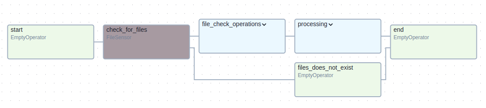
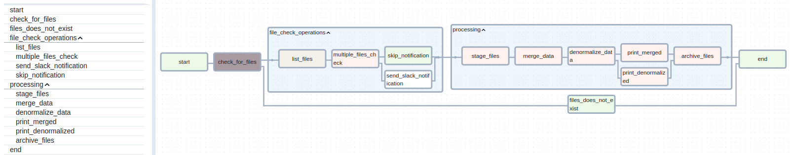

# Lab 5: Organizing Tasks with TaskGroups in Airflow

This lab expands on the data pipeline you built in Lab 4, focusing on improving DAG organization and readability using TaskGroups. TaskGroups provide a way to logically group related tasks, simplifying complex workflows in the Airflow UI and making your code easier to maintain.

## Objective

Refactor the Lab 4 DAG (`lab4_dag.py`) to utilize TaskGroups, enhancing its visual structure and maintainability.

## Task

Create two TaskGroups within the existing DAG:

1. **`file_check_operations`**: This group will encompass the following tasks:
    - `list_files`: Lists transaction files in the `data/transactions/` directory.
    - `multiple_files_check`: Checks if more than one file is present.
    - `send_slack_notification`: Sends a Slack notification if multiple files exist.
    - `skip_notification`: A placeholder task executed when there aren't multiple files, ensuring the DAG flow continues smoothly.

2. **`processing`**: This group will encapsulate the core data transformation and processing steps:
    - `stage_files`: Moves listed files to a temporary staging directory (`data/staging/{{ts}}/`).
    - `merge_data`: Merges staged transaction data with customer data from `data/customers.csv`.
    - `denormalize_data`: Converts the enriched, merged JSON data into a denormalized CSV format.
    - `archive_files`: Archives processed files from staging to `data/processed/`, appending a timestamp to their names.

## Instructions

1. **Import `TaskGroup`:** Add `from airflow.utils.task_group import TaskGroup` to your Python script.

2. **Define TaskGroups:** Create instances of `TaskGroup`:
   ```python
   with TaskGroup("file_check_operations") as file_check_operations:
       # Add tasks here...
   with TaskGroup("processing") as processing:
       # Add tasks here
   ```

3. **Place Tasks within Groups:**  Move the specScreenshot from 2024-11-22 23-56-27ified tasks into their respective TaskGroups, indenting them correctly within the `with` blocks.

4. **Set Task Dependencies (within and between groups):**  Ensure correct task execution order within each TaskGroup and between the groups themselves. `file_check_operations` should execute after the `check_for_files` sensor and drive branching logic for notifications. `processing` tasks should run after file checks and notifications are handled.

5. **Connect TaskGroups in the DAG:** Chain the TaskGroups and other tasks together in the DAG to establish the correct workflow sequence: `start >> check_for_files >> file_check_operations >> processing >> end`.


6. **Run the DAG:** Deploy and trigger the modified DAG, observing task execution within the TaskGroups to verify the changes.

## Tips
- After changes the code should look like the following:

- The groups may be expanded to:
